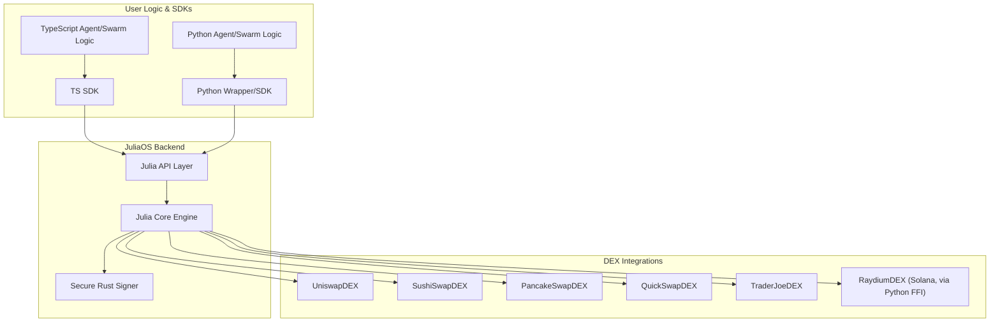

# JuliaOS Open Source AI Agent & Swarm Framework

*joo-LEE-uh-oh-ESS* /ˈdʒuː.li.ə.oʊ.ɛs/

**Noun:**
**A powerful multi-chain, community-driven framework for AI and Swarm technological innovation, powered by Julia.**

Translations:
[🇨🇳 汉语](/docs/translations/汉语.md) | [🇦🇪 اَلْعَرَبِيَّةُ](/docs/translations/اَلْعَرَبِيَّةُ.md) | [🇩🇪 Deutschland](/docs/translations/Deutschland.md)| [🇫🇷 Français](/docs/translations/Français.md) | [🇮🇹 Italiano](/docs/translations/Italiano.md) | [🇪🇸 Español](/docs/translations/Español.md)


## Overview

JuliaOS is a comprehensive framework for building decentralized applications (DApps) with a focus on agent-based architectures, swarm intelligence, and cross-chain operations. It provides both a CLI interface for quick deployment and a framework API for custom implementations. By leveraging AI-powered agents and swarm optimization, JuliaOS enables sophisticated strategies across multiple blockchains.

## Documentation

- 📖 [Overview](https://juliaos.gitbook.io/juliaos-documentation-hub): Project overview and vision
- 🤝 [Partners](https://juliaos.gitbook.io/juliaos-documentation-hub/partners-and-ecosystems/partners): Partners & Ecosystems

### Technical

- 🚀 [Getting Started](https://juliaos.gitbook.io/juliaos-documentation-hub/technical/getting-started): Quick start guide
- 🏗️ [Architecture](https://juliaos.gitbook.io/juliaos-documentation-hub/technical/architecture): Architecture overview
- 🧑‍💻 [Developer Hub](https://juliaos.gitbook.io/juliaos-documentation-hub/developer-hub): For the developer

### Features

- 🌟 [Core Features & Concepts](https://juliaos.gitbook.io/juliaos-documentation-hub/features/core-features-and-concepts): Important features and fundamentals
- 🤖 [Agents](https://juliaos.gitbook.io/juliaos-documentation-hub/features/agents): Everything about Agents
- 🐝 [Swarms](https://juliaos.gitbook.io/juliaos-documentation-hub/features/swarms): Everything about Swarms
- 🧠 [Neural Networks](https://juliaos.gitbook.io/juliaos-documentation-hub/features/neural-networks): Everything about Neural Networks
- ⛓️ [Blockchains](https://juliaos.gitbook.io/juliaos-documentation-hub/features/blockchains-and-chains): All blockchains where you can find JuliaOS
- 🌉 [Bridges](https://juliaos.gitbook.io/juliaos-documentation-hub/features/bridges-cross-chain): Important bridge notes and information
- 🔌 [Integrations](https://juliaos.gitbook.io/juliaos-documentation-hub/features/integrations): All forms of integrations
- 💾 [Storage](https://juliaos.gitbook.io/juliaos-documentation-hub/features/storage): Different types of storage
- 👛 [Wallets](https://juliaos.gitbook.io/juliaos-documentation-hub/features/wallets): Supported wallets
- 🚩 [Use Cases](https://juliaos.gitbook.io/juliaos-documentation-hub/features/use-cases): All use cases and examples
- 🔵 [API](https://juliaos.gitbook.io/juliaos-documentation-hub/api-documentation/api-reference): Julia backend API reference

## Quick Start

### Prerequisites

You will need:
- [Julia](https://julialang.org/) (version >= 1.11.4) to run the backend without Docker &ndash; see [the official installation instructions](https://julialang.org/install/). The method currently recommended is to install [juliaup](https://github.com/JuliaLang/juliaup), which you can then use to install and manage various versions of Julia;
- [Python](https://www.python.org/) (version >= 3.11) to run scripts using the `juliaos` Python package or the A2A server &ndash; see [the downloads on the official Python website](https://www.python.org/downloads/);
- [Docker](https://www.docker.com/) to easily run the database, or optionally the entire backend;
    - if you want to avoid installing docker, you will need an alternative way to set up a postgres database for the backend to function.

### JuliaOS Backend

First, navigate to the `backend/` subdirectory and prepare an `.env` file:

```
cd backend
cp .env.example .env
```

Optionally, adjust the values therein as desired. (The various API keys will not be needed unless you want to use the specific tools and strategies that use them.)

#### Running the Backend with Docker

If you have [Docker](https://www.docker.com/) installed, you can now run the backend simply by running the following from the `backend/` directory:

```
docker compose up
```

#### Running the Backend outside of Docker

If you want to run the backend outside of Docker, you will first need to have a postgres database for the backend running &ndash; you can either set it up yourself (see [the backend README](./backend/README.md) for more details), or run just the database using Docker as follows:

```
docker compose up julia-db
```

You also need to install all the required Julia packages:

```
julia --project=. -e "using Pkg; Pkg.instantiate()"
```

Once you have everything set up (the `.env` file, the database, and the installed packages), you can run the server as follows:

```
julia --project=. run_server.jl
```

For more details, see [the backend README](./backend/README.md).

### Python Module

Once you have the backend running, one way to interact with it is to directly use the server's rest API (see `backend/examples/` for some examples), however, it is much simpler to use the enclosed `juliaos` Python package.

First, from the root of the repository, navigate to the `python/` subdirectory:

```
cd python
```

Optionally, to avoid modifying your global Python installation, set up and activate a [virtual environment](https://docs.python.org/3/library/venv.html).

You can now install the package using

```
pip install -e .
```

Note that this performs an editable install, meaning that any changes made to the code of the package will be reflected in any scripts using the package.

#### Running the scripts

After installing the `juliaos` package as described in the previous section, you should be able to run the simpler scripts in `python/scripts/`, e.g.:

```
python scripts/run_example_agent.py
```

Note again that this requires the backend to be running.

However, some of the scripts (e.g. ones interacting with X or Telegram) will also need appropriate API keys. For these you need to:
- have an `.env` file with the necessary keys (see `.env.example`),
- have the `dotenv` package installed (this should happen as part of the `juliaos` package installation, but you can also just do `pip install dotenv`).

You can create your own scripts based on the existing ones and run them just the same.

For more details, see [the Python package README](./python/README.md)

## Architecture Overview

JuliaOS is built as a modular, multi-layered system for cross-chain, agent-based, and swarm intelligence applications. The architecture is designed for extensibility, security, and high performance, supporting both EVM and Solana ecosystems.

**Key Layers:**

- **User Logic & SDKs**
  - **TypeScript SDK & Logic Layer:**
    - Location: `packages/core/`, `packages/templates/agents/`
    - Users write agent and swarm logic in TypeScript, using the SDK to interact with the Julia backend.
  - **Python Wrapper/SDK & Logic Layer:**
    - Location: `packages/pythonWrapper/`, `packages/templates/python_templates/`
    - Users write agent and orchestration logic in Python, using the wrapper to interact with JuliaOS.

- **JuliaOS Backend**
  - **Layer 1: Julia Core Engine (Foundation Layer):**
    - Location: `julia/src/`
    - Implements core backend logic: agent orchestration, swarm algorithms, neural networks, portfolio optimization, blockchain/DEX integration, price feeds, storage, and trading strategies.
  - **Layer 2: Julia API Layer (Interface Layer, MCP-Enabled):**
    - Location: `julia/src/api/`
    - Exposes all backend functionality via API endpoints (REST/gRPC/MCP), validates and dispatches requests, formats responses, and enforces API-level security.
  - **Layer 3: Rust Security Component (Specialized Security Layer):**
    - Location: `packages/rust_signer/`
    - Handles all cryptographic operations (private key management, transaction signing, HD wallet derivation) in a secure, memory-safe environment, called via FFI from Julia.

- **DEX Integrations**
  - Modular DEX support for Uniswap, SushiSwap, PancakeSwap, QuickSwap, TraderJoe (EVM), and Raydium (Solana) via dedicated modules in `julia/src/dex/`.
  - Each DEX module implements the AbstractDEX interface for price, liquidity, order creation, trade history, and token/pair discovery.

- **Risk Management & Analytics**
  - Global risk management is enforced via `config/risk_management.toml` and `julia/src/trading/RiskManagement.jl`.
  - Real-time trade logging and analytics are provided by `julia/src/trading/TradeLogger.jl`, outputting to both console and file.

- **Community & Contribution**
  - Open-source, community-driven development with clear contribution guidelines and modular extension points for new agents, DEXes, and analytics.

**Architecture Diagram:**



## Repository Overview

The JuliaOS repository contains several interacting components organized in separate directories, which we will briefly go over before diving deeper into some of them:

- `a2a/` &ndash; contains an implementation of the A2A server (which requires the JuliaOS Backend to run);
- `backend/` &ndash; contains the most recent version of the JuliaOS Backend, realizing the agent functionality alongside an attached server and database;
    - this directory also contains the OpenAPI specification of the server API, located at `backend/src/api/spec/api-spec.yaml`;
- `docs/` &ndash; contains several translations of the base README file;
- `python/` &ndash; contains the implementation of the python `juliaos` package which can be used to write scripts interacting with the JuliaOS backend, with several such example scripts also included;
- `config/`, `julia/`, `packages/` and `workflows/` are leftovers from an earlier state of the repository, currently deprecated, but left with the potential of being partially integrated into the current state at some point in the future.

### The JuliaOS Backend

In the `backend/` subdirectory, you can find the core of the agent framework, including a database and a server providing access to the agent functionality. It also includes the OpenAPI specification of the server interface (found at `backend/src/api/spec/api-spec.yaml`) which is used to generate parts of the server as well as the python package, and can be used to generate parts of other frontend clients as well.

More specific information can be found in its README at [`backend/README.md`](./backend/README.md).

### The A2A Server

The A2A server can be found in the `a2a/` subdirectory, as a Python application separate which is separate from the JuliaOS Backend server, but needs it for its functionality. You can find more information about it in its README at [`a2a/README.md`](./a2a/README.md).

### The Python Module

The `python/` subdirectory contains the implementation of the `juliaos` Python package, which can be used to interact programatically with the JuliaOS Backend. Under `python/scripts/` you will find several example scripts to illustrate how to use the package.

For more information, see its dedicated README at [`python/README.md`](./python/README.md).

### Deprecated Code

Across the repository, including in some of the top-level files, you may find references to files contained in some of the subdirectories described here as "deprecated" &ndash; while these parts of the codebase are not used by the current versions of the components, described in the previous sections, they are left in the repository in case some parts of them get reused later and integrated with the rest of the repository. The `julia/` subdirectory contains the julia code of a previous implementation of the JuliaOS Backend, while `packages/` provides supporting packages for this backend, generally written in other languages such as TypeScript and Python.

## 🧑‍🤝‍🧑 Community & Contribution

JuliaOS is an open-source project, and we welcome contributions from the community! Whether you're a developer, a researcher, or an enthusiast in decentralized technologies, AI, and blockchain, there are many ways to get involved.

### Join Our Community

The primary hub for the JuliaOS community is our GitHub repository:

* **GitHub Repository:** [https://github.com/Juliaoscode/JuliaOS](https://github.com/Juliaoscode/JuliaOS)
    * **Issues:** Report bugs, request features, or discuss specific technical challenges.
    * **Discussions:** (Consider enabling GitHub Discussions) For broader questions, ideas, and community conversations.
    * **Pull Requests:** Contribute code, documentation, and improvements.

### Ways to Contribute

We appreciate all forms of contributions, including but not limited to:

* **💻 Code Contributions:**
    * Implementing new features for agents, swarms, or neural network capabilities.
    * Adding support for new blockchains or bridges.
    * Improving existing code, performance, or security.
    * Writing unit and integration tests.
    * Developing new use cases or example applications.
* **📖 Documentation:**
    * Improving existing documentation for clarity and completeness.
    * Writing new tutorials or guides.
    * Adding examples to the API reference.
    * Translating documentation.
* **🐞 Bug Reports & Testing:**
    * Identifying and reporting bugs with clear reproduction steps.
    * Helping test new releases and features.
* **💡 Ideas & Feedback:**
    * Suggesting new features or enhancements.
    * Providing feedback on the project's direction and usability.
* ** evangelism & Advocacy:**
    * Spreading the word about JuliaOS.
    * Writing blog posts or creating videos about your experiences with JuliaOS.

### Getting Started with Contributions

1.  **Set Up Your Environment:** Follow the [Quick Start](#quick-start)
2.  **Find an Issue:** Browse the [GitHub Issues](https://github.com/Juliaoscode/JuliaOS/issues) page. Look for issues tagged with `good first issue` or `help wanted` if you're new.
3.  **Discuss Your Plans:** For new features or significant changes, it's a good idea to open an issue first to discuss your ideas with the maintainers and community.
4.  **Contribution Workflow:**
    * Fork the [JuliaOS repository](https://github.com/Juliaoscode/JuliaOS) to your own GitHub account.
    * Create a new branch for your changes (e.g., `git checkout -b feature/my-new-feature` or `fix/bug-description`).
    * Make your changes, adhering to any coding style guidelines (to be defined, see below).
    * Write or update tests for your changes.
    * Commit your changes with clear and descriptive commit messages.
    * Push your branch to your fork on GitHub.
    * Open a Pull Request (PR) against the `main` or appropriate development branch of the `Juliaoscode/JuliaOS` repository.
    * Clearly describe the changes in your PR and link to any relevant issues.
    * Be responsive to feedback and participate in the review process.

### Implementing Tools and Strategies for Agents

Any agent created in the JuliaOS system is guided by a single pre-selected *strategy*, which can use one or more of the provided *tools*. The implementations for these can be found in `backend/src/agents/strategies/` and `backend/src/agents/tools/`, respectively. New tools and strategies can be added by analogy with previous ones.

To add a new tool:

1. Create a new file with a descriptive name for it under `backend/src/agents/tools/`;
2. In this file, define:
    - A configuration structure for the tool (it is allowed to be empty if your tool doesn't need configurable variables),
    - A function to realize the functionality of the tool (the interface of the function is not fixed and can be arbitrary, as the function is called directly from strategies),
    - Metadata for the tool, including a name which needs to be different from all other implemented tools,
    - A `ToolSpecification` structure summarizing all of the above;
3. Register your tool in `backend/src/agents/tools/Tools.jl` by adding:
    - An `include` line with the relative path to your new file,
    - A call of `register_tool(X)` where `X` is your `ToolSpecification` structure.

To add a new strategy:

1. Create a new file with a descriptive name for it under `backend/src/agents/strategies/`;
2. In this file, define:
    - A configuration structure for the strategy (allowed to be empty),
    - Optionally, a structure for the input of one strategy execution (otherwise, add `nothing` in its place in the specification),
    - Optionally, an initialization function for the strategy, which gets executed on agent creation (otherwise, add `nothing` in its place in the specification); this function needs to take exactly two parameters, which are, in order, the configuration of the strategy, and the `AgentContext` of the executing agent,
    - A function realizing the functionality of the strategy; this function needs to take exactly three parameters, which are, in order, the configuration of the strategy, the `AgentContext` of the executing agent, and the strategy input structure,
    - Metadata for the strategy, including a name which needs to be different from all other implemented strategies,
    - A `StrategySpecification` structure summarizing all of the above, using `nothing` for missing optional values;
3. Register your strategy in `backend/src/agents/strategies/Strategies.jl` by adding:
    - An `include` line with the relative path to your new file,
    - A call of `register_strategy(X)` where `X` is your `StrategySpecification` structure.

### Contribution Guidelines

We are in the process of formalizing our contribution guidelines. In the meantime, please aim for:

* **Clear Code:** Write readable and maintainable code. Add comments where necessary.
* **Testing:** Include tests for new functionality and bug fixes.
* **Commit Messages:** Write clear and concise commit messages (e.g., following Conventional Commits).

We plan to create a `CONTRIBUTING.md` file with detailed guidelines soon.

### Code of Conduct

We are committed to fostering an open, welcoming, and inclusive community. All contributors and participants are expected to adhere to a Code of Conduct. We plan to adopt and publish a `CODE_OF_CONDUCT.md` file (e.g., based on the Contributor Covenant) in the near future.

